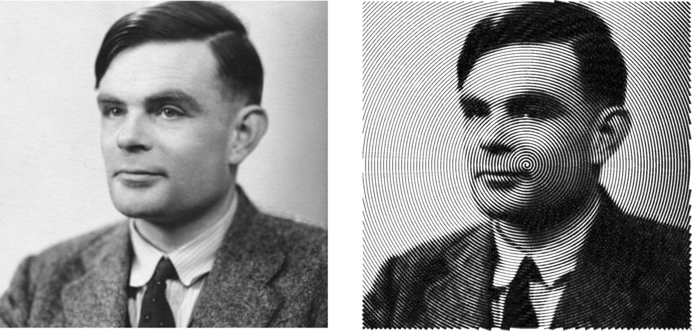

# Spiraliser

converts a jpg image into an SVG spiral. 

# Requirements

* Python3
* PyQT5

# Thanks

* [Krummrey for their code](https://github.com/krummrey/SpiralFromImage) that I converted from Java to Python.

# Other useful bits

* hp2xx is an hpgl viewer - sudo apt-get install hp2xx
* pstoedit for converting eps to hpgl: [my modified version for big files](https://github.com/mattvenn/pstoedit-3.70)
* [hp gl viewer](http://service-hpglview.web.cern.ch/service-hpglview/download_index.html) from cern (requires installation of libjpeg62 and [libxp](https://packages.ubuntu.com/trusty/amd64/libxp6/download)
* [stabilo 88 pen holder for roland plotters](https://www.thingiverse.com/thing:244675)

# Conversions

pstoedit can convert to hpgl format. But it can't read SVGs, so an intermediate
format is needed.

## svg to eps

    inkscape save.svg --export-eps save.eps

works on some files but on others, the exported eps is a rastered image of the
vectors, so pstoedit can't use it. Seems to work better on svg files that
inkscape hasn't authored.

## eps to hpgl

    pstoedit -f hpgl save.eps save.hpgl

Other useful commands for pstoedit

* -xshift and -yshift, move the hpgl around. Units seem to be 2.84 per mm. So to
 shift 10mm horizontally, use -xshift 28.4
* -xscale and -yscale, scales the hpgl. -xscale 2 -yscale 2 to double the image.
